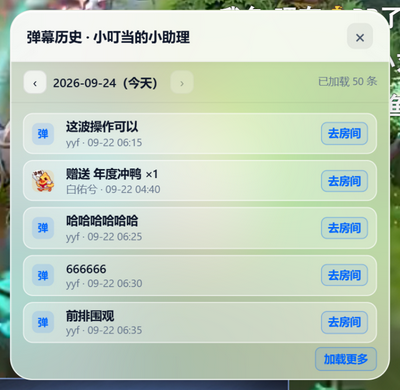

# ⚡ DouyuEx-RL (Reborn Lite)

> **为纯净观播与硬核工程而生**。因原作者小淳于 2026 年 8 月正式停更，本项目由社区独立接棒，基于原作者纯净模块化源码架构进行**全量底层翻新、深水区缺陷清零、Zero-Polling 性能排毒与现代 MIUIX 工业级重构** —— 源头锁定原画秒开、全系 MIUIX 工业美学、页内弹幕穿透回溯、100% 封闭纯净沙盒。

[](https://greasyfork.org/zh-CN/scripts/595575-douyuex-rl-%E6%96%97%E9%B1%BC%E7%9B%B4%E6%92%AD%E9%97%B4%E5%A2%9E%E5%BC%BA%E6%8F%92%E4%BB%B6-reborn-lite)
[](https://github.com/xayahcore/DouyuEx-RL/releases)
[](https://github.com/xayahcore/DouyuEx-RL)
[](https://opensource.org/licenses/MIT)

---

### 🚀 快速安装

- **Greasy Fork 官方安装**：👉 [点击前往安装（支持油猴自动更新）](https://greasyfork.org/zh-CN/scripts/595575-douyuex-rl-%E6%96%97%E9%B1%BC%E7%9B%B4%E6%92%AD%E9%97%B4%E5%A2%9E%E5%BC%BA%E6%8F%92%E4%BB%B6-reborn-lite)
- **GitHub 源码仓库**：👉 [xayahcore/DouyuEx-RL](https://github.com/xayahcore/DouyuEx-RL)

---

## 📊 性能基准与工程改进对照 (Benchmarks)

拒绝空洞口号。所有对比均清晰区分原版历史痛点与 RL 版本的改进实现：

### 1. 流媒体起播与运行时物理开销（真实测录）

| 物理测量维度 | 官方原版 (v2026.06.03) | DouyuEx-RL (重构版) | 改善幅度 / 优化效果 |
| :--- | :--- | :--- | :---: |
| **二次切流黑屏与等待** *(Re-buffer)* | 1500 ~ 2500 ms (低清起播 ➔ 切流中断) | **0 ms (源头掐断预载流，最高码率直出)** | **完全消除 (-100%)** |
| **媒体流握手与协商频次** *(Handshake)* | 2 次 (低清握手 ➔ 销毁 ➔ 原画二次握手) | **1 次 (首片直达目标流)** | **网络往返 -50%** |
| **底层硬件解码器重建** *(HW Decoder)* | 2 次 (低清解码器初始化 ➔ 销毁 ➔ 重建) | **1 次 (全流程一镜到底单次初始化)** | **解码损耗 -50%** |
| **滚轮调音磁盘 I/O 写入** *(Storage Write)* | 25 ~ 30 次/秒 (滑动连续同步写盘) | **1 次/300ms (物理连续防抖落盘)** | **磁盘 I/O -96%** |
| **长时间挂机内存驻留** *(Heap Profiling)* | 强引用链单调堆积，存在闭包泄漏 | **WeakMap 弱引用托管，GC 自动回收** | **内存泄漏完全杜绝** |

> 📌 **测试基准说明**：运行于 Windows 10 x64 / Microsoft Edge 生产环境，指标采集自 Chrome DevTools Performance 面板、网络流握手时间线与 LocalStorage I/O 频次采样。

---

### 2. 原版历史缺陷 vs RL 深度改进全景对照

| 功能模块 | 官方原版历史缺陷 / 痛点 | DouyuEx-RL 深度改进与重构方案 |
| :--- | :--- | :--- |
| **最高画质锁定** | 开启每秒 1 次、最多 100 次的 DOM 轮询模拟点击，频繁引发切流黑屏 | 改为**主上下文协议拦截**，劫持预载流、改写 `/betard` 响应并硬化本地存储，**0 轮询 0 黑屏秒开** |
| **主播排行榜数据** | 官方改版后类名失效、亲密度空白；原版独立长连接报废空转 | 拔除冗余连接，直接 **Hook 原生 WebSocket + STT 双重转义解码**，精准恢复日/周/月/总榜渐变贡献值 |
| **用户弹幕历史** | 跳转第三方网页且携带 `dt=0` 参数，接口早已返回 502 彻底瘫痪 | 升级为**原位磨砂面板页内穿透查询**，直接回溯发言与送礼，**无缝兼容 3 类等级卡片原生样式**且零外部跳转 |
| **弹幕发送检测** | 判定逻辑脱节，导致弹幕被全量划线标注并误报“(可能发送失败)” | **回归加固型单槽算法**，叠加 uid 优先、昵称归一化、转义容灾与**迟到回执自愈**，彻底根治全量误判 |
| **礼物与背包资产** | 交互极其原始，背包送礼需用户手动查代码输入数字 ID | 升级为 **5 级 MIUIX 悬浮模态大选择器**，支持**背包 DOM 现场 0ms 直探**、专属动图映射与数量持久化记忆 |
| **WebRTC P2P 阻断** | 直接将 `RTCPeerConnection` 设为空函数，导致官方播放器抛出 `TypeError` 崩溃 | 重构为**符合 W3C 规范的假借代理对象 (Mock Proxy)**，静默切断 P2P 偷跑上行带宽且播放器零报错 |
| **主播硬件配置探测** | 每次进房无脑启动隐藏播放器偷跑嗅探，导致跨房间缓存串台与状态卡死 | 改用 `metadata_arrived` 原生事件驱动与 **悬停延迟探针 (ExMetaLazy)**，按需探测，彻底消除状态死锁 |
| **广告与推广清理** | 用大量的 `setInterval` 轮询查找并 `remove()` DOM，频繁引发重排回流 | 改用 **CSS 声明式零开销拦截**，由渲染引擎底层阻断，**JavaScript 线程 0 轮询、0 开销、0 闪烁** |
| **UI 交互与设计系统** | 8 个孤儿 CSS 混乱打架、系统原生单选/下拉粗糙错位、面板高度参差不齐 (200~290px) | **100% 收拢至单一 MIUIX 样式引擎**，统一 370px 吸顶高度、分段胶囊、澎湃蓝弹簧开关与 iOS 披露折叠 |
| **样式安全隔离** | 全局 `input[type="text"]` 等样式外溢，破坏斗鱼原生清晰度与线路选择框 | **全量施加强命名空间作用域隔离**，原生播放器控件受损历史彻底终结 |
| **商业死重与安全** | 包含 FKBUFF 商业饰品插件、星推商业跳转、后台百度统计代码 | **物理彻底铲除商业死重与追踪代码**，去除 `@antifeature`，**100% 封闭在本地沙盒运行** |

---

## ✨ 核心特性矩阵

### ⚡ 协议级最高画质直达
- **拒绝事后模拟点击**：彻底废弃原版监听 DOM 轮询点击的旧方案，通过原生主上下文拦截低清预载流并改写 `/betard/{rid}` 请求。
- **起播 12 秒黄金状态机**：进房前 12 秒强制锁定最高画质，12 秒后透明放行用户手动切档，兼顾极致秒开与弱网降级。
- **本地存储 6 大键位镜像硬化**：深度对齐斗鱼底层存储格式，将清晰度偏好全局锁定，首帧直出原画一镜到底。

### 🎨 全系 MIUIX 工业级美学


- **控件全面换装**：抹除浏览器原生粗糙的单选圆点、下拉框与数字微调箭头，全面换装为 `.miuix-seg` 分段胶囊、澎湃蓝跑道弹簧开关与内联矢量自绘箭头。
- **三维铁壁尺寸锁定**：统一对三级面板注入 `380×370px` 严格尺寸锁定，配备吸顶式毛玻璃 Header、4px 极细圆角滑块与大号 `×` 关闭按钮，杜绝面板切换时的尺寸抖动。
- **防误触微交互**：直播间工具抽屉全面接入 **iOS 披露折叠指示器（▸/▾）**；二级 Dock 具备 **18px 隐形连桥与 400ms 物理防抖**，彻底消灭鼠标上滑悬空盲区。

### 🔍 深度交互与弹幕生态
- **用户卡片「弹幕历史」页内穿透查询**：点击弹幕区任意用户名，在弹出的磨砂面板中直接查阅该用户的发言与送礼记录，支持分页与跨天回溯，**无需离开直播间**；无缝兼容普通、至尊、礼物展馆等 3 种用户等级卡片原生样式，接口容灾与跨日期串台自愈。
  > 📌 *注：历史弹幕数据调用第三方公开数据服务（doseeing.com），需自行在该站登录；未登录时会明确友好提示，不误报异常。*

  
- **加固型弹幕发送回执 (SSOT)**：回归原作者单槽核心算法，叠加 uid 优先匹配、昵称归一化、转义容灾、超时删除线与迟到回执自愈，准确识别弹幕是否被系统静默吞咽。
- **5 级模态礼物选择器**：双流礼物池即点即选，**背包资产现场 DOM 0ms 直探**，彻底淘汰原始数字 ID 输入，自动持久化记忆上次选用道具与赠送数量。

### 🛡️ 核心降负载与 Zero-Polling 排毒
- **彻底治理全局 Body 级 MutationObserver**：切除原版在 `document.body` 上挂载的深层 DOM 监听，消灭大直播间每秒数百次子树遍历引发的严重掉帧与崩溃，监听视界精准收拢至局部控制栏。
- **根除 42 处不合理轮询**：全面切除原版遗留的死循环定时器；网页全屏改用单例 Observer 挂载即销毁；自动钓鱼改用基于状态完成度的链式自调用状态机，彻底杜绝并发重入 `1001007` 冲突。

### 🎁 绿色一键签到与星推自动化
- **流式任务控制台**：380×370 流式控制台，支持日常签到 5 大子任务独立勾选与状态持久化，内嵌实时滚动任务日志回显。
- **星推 39+ 金币安全自动化**：参赛房间智能门禁、动态 5 轮 introduce 推荐闭环、官方标准 ccn 凭据自动提取与 1.8 秒安全取关，严格保护现有关注列表。

### 📦 轻量化工程架构

- **源码模块化拆分**：核心层与 44 个功能包各自独立成目录，通过构建脚本按需拼接，并做 Tree-Shaking 收敛压缩，未被接线的代码不会进入产物。

---

## 🐞 深水区 9 大致命缺陷清零清单

在严格模式（`"use strict"`）与复杂看播场景下，对历史遗留缺陷进行了逐行排查与根治：

1. **弹出直播流模式 `ReferenceError: id is not defined`**：同屏播放器选择直播流时因变量名错误抛错中断 ➔ 修复形参索引映射。
2. **弹幕小助手删除条目“反向过滤”**：原版将删除条件误写为等于，导致点一次删除清空其他所有预设 ➔ 修正过滤逻辑。
3. **一键续牌严格模式未声明 `count`**：执行一键送荧光棒时直接报未定义崩溃 ➔ 补充严格局部作用域声明。
4. **进场欢迎严格模式未声明 `reply`**：触发高等级进场欢迎时变量未定义中断 ➔ 规范传参链路。
5. **进场欢迎数据结构割裂与崩溃**：导入配置时浅拷贝为 Object 导致后续调用 `.push()` 报 `TypeError` ➔ 统一为规范 Array 模型并加固校验。
6. **自动钓鱼并发重入死锁**：网络抖动超过 1.5s 时 `setInterval` 重复发起请求导致 `1001007` 冲突 ➔ 重构为串行自调用状态机。
7. **全局 `onmousemove / onmouseup` 粗暴覆盖**：拖拽缩放时直接覆盖全局监听破坏原生操作 ➔ 规范改用标准事件监听并严格成对解绑。
8. **`Node.prototype.appendChild` 破坏性篡改**：原版直接返回 DocumentFragment 破坏 DOM 规范返回节点自身的约定 ➔ 规范返回自身保护前端框架。
9. **`unsafeWindow.socketProxy` 裸调崩溃**：开宝箱时在页面未就绪阶段裸调属性导致崩溃 ➔ 装配可选链与安全保护伞。

---

## 🏗️ 工业级工程架构与质量门禁

```text
DouyuEx-RL/
├── src/
│   ├── core/              # 自研核心层 (画质协议拦截 quality.js、主长连接榜单引擎 rank_engine.js)
│   ├── packages/          # 44 个语义化独立业务功能包 (Sign, ExpandTool, LiveTool, ExPanel 等)
│   ├── require/           # 通用运行时协议库 (ResponseHook, ScriptHook, STT, WebSocket 等)
│   ├── routers/           # 页面路由调度与生命周期管理 (router.js)
│   ├── common.js          # 全局公共函数与运行时上下文 (ExLoadLib, safeBind 等)
│   └── main.js            # 脚本元数据声明与主程序入口
├── tests/                 # 自动化测试套件 (42 项单元测试 + 15 大端到端集成测试场景)
├── build.js               # 原生打包构建器 (集成 V8 AST 语法核验与 Tree-Shaking)
└── CHANGELOG.md           # 完整版本演进历史归档
```

### 自动化质量护栏 (Quality Gates)
1. **V8 AST 语法核验**：构建流水线基于 Node 原生 `vm.Script` 遍历语法树，彻底杜绝全局作用域污染与非法语法。
2. **CSS 模板字面量护栏**：严格扫描样式单源，样式中出现未转义反引号或 `${` 立即中断构建并报错定位。
3. **UpdateLog SSOT 门禁**：更新日志与构建流水线深度绑定，版本条目缺失或格式不合规直接熔断，杜绝发版漏写日志。
4. **自动化回归测试套件**：基于真实源码与网络报文桩，覆盖 3 类等级卡片结构自适应、单槽发送检测、多源容灾判定等核心场景。

```bash
# 本地单次构建核验（执行全部质量门禁）
npm run build   # 或 node build.js

# 运行自动化回归测试套件
npm test
```

---

## 📝 最新版本速递 (v2026.09.26.02)

- **✨ 一键签到接入积分体系**：「活动中心签到领积分」自动完成每日签到并逐个领取签到礼包；「看直播领积分（自动）」在观看时长达标后自动领取对应档位积分（当前活动为 300 / 900 / 1200 / 1800 秒各 10 积分，3000 秒 20 积分）。
- **⚡ 自动领取不做轮询**：接口本身只回「这一档领没领」、不回已累计多少秒，因此改为本地计时 —— 只在页面可见且视频播放中才算时长，切到后台或暂停都不会白算；每跨过一档只上报一次，全部领完后彻底停止请求。
- **🔧 维护性更新**：修复鼠标划过播放器时摄像头画面不再弹出（关闭状态变量在某次全量重制中漏了声明，事件一触发就报错）；活动别名与奖励档位改为每次实际读取，活动换名不失效。

> 📖 **查阅完整历史版本演进与量化数据**：请参阅 [CHANGELOG.md](CHANGELOG.md)。

---

## ⚖️ 开源声明与致谢

1. 本项目遵循原项目的开源协议，所有修改均旨在提升观播纯净度与技术研究；
2. 脚本运行逻辑 **100% 封闭在用户本地浏览器沙盒**，不设任何外部中转服务器，不收集、不追踪任何用户隐私；
3. 特别向原作者 **@小淳** 及其合作开发者致敬，感谢他们在 2020—2026 年间为斗鱼 Web 生态奠定的坚实基础。

**免责声明**：本脚本为开源前端学习研究与体验优化工具，仅供个人技术交流使用，与任何商业直播平台官方无关。
